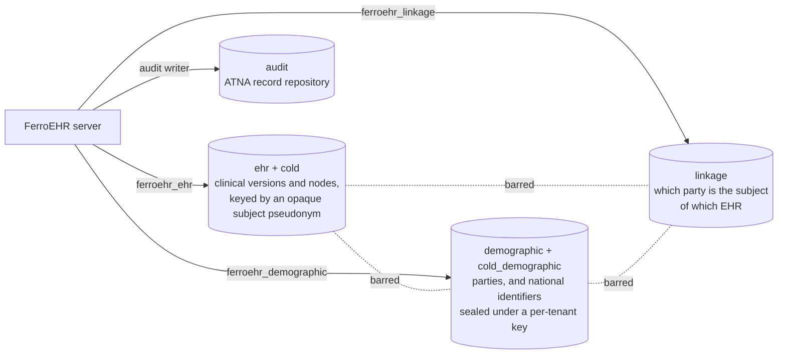

# Security & multi-tenancy

A clinical data repository holds PHI, so its access controls and audit trail
are part of the product. This chapter covers the four
security surfaces you configure when you deploy FerroEHR: **authentication**
(who is calling), **authorization** (what they may do), **multi-tenancy**
(isolating independent logical systems), and the **ATNA audit trail**
(recording what happened). Each is independently configurable, and each is
described here in terms of the environment variables you actually set.

This chapter tells you **how to configure each control**. Its companions tell you
the rest: the [Threat model](threat-model.md) states **what remains true after
each control has done its job**: the trust boundaries, the residual risk at
each, and what this software explicitly does not defend against; and
[Verifying releases](verifying-releases.md) covers the artifacts themselves:
how to establish that the binary, image, or chart you downloaded came from this
project's own build. Read the threat model before you decide a control is
sufficient for your deployment.

<!-- toc -->

Configuration follows the same pattern throughout: the server reads defaults,
then the single `ferroehr.toml` file, then environment variables, with `__`
separating nested keys. The security configuration groups live in
distinct sections of `ferroehr.toml`: `[auth]` (authentication), `[tenancy]`
(multi-tenancy), `[authz]` (authorization), and `[audit]`
(the ATNA audit trail). Any key can be overridden with the matching
`FERROEHR_*` environment variable shown below.

## Authentication

Authentication is on by default (`FERROEHR__AUTH__ENABLED=true`). Setting
it to `false` lets all requests through unauthenticated, a development-only
mode.

There is no single "mode" switch. The server offers two mechanisms and enables
each by the presence of its configuration block:

- **HTTP Basic** is active when a `basic` block with a user list is
  configured. Each user has a username, an Argon2 password hash (a PHC string
  beginning `$argon2id$`) or a `password_hash_file` pointing at one, and a set
  of roles (defaulting to `["USER"]`). Because it is a list of users, the Basic
  block is normally supplied through the TOML configuration file rather than
  environment variables.
- **OAuth2/OIDC bearer tokens** are active when an `oidc` block is configured.
  The server validates the token's signature, issuer, and audience.

Both mechanisms are validated at startup, and a configuration the server cannot
honour **refuses to boot** rather than degrading at the first request:

| Configuration | Boot outcome |
|---|---|
| `auth.enabled = true` with no mechanism | error: a `401` challenge must name a scheme the server implements (RFC 9110 §11.6.1) |
| `[auth.oidc]` with no `audiences` | error: a server with no declared audience cannot reject another server's token (RFC 7519 §4.1.3) |
| `[auth.oidc] issuer` not `https`, or carrying a query/fragment | error: RFC 8414 §2, §6.2 (`allow_insecure_issuer = true` opts a dev issuer out of the scheme rule only) |
| `[auth.oidc] clock_skew_leeway_seconds` above `300` | error: leeway may be "no more than a few minutes" (RFC 9068 §4 step 6) |
| `[auth.oidc] hmac_secret` under 32 bytes | error: RFC 8725 §3.5 forbids memorizable passwords as keyed-MAC keys |
| `[auth.oidc]` with **both** `hmac_secret` and `jwks_json` (or their `*_file` forms) | error: two competing key sources, never resolved by silent precedence |
| `[auth.oidc] algorithms` naming `none`, or empty | error: an unsigned token proves nothing |
| `[auth.oidc] algorithms` disagreeing with the key source | error: `HS*` verifies only against a symmetric secret, `RS*`/`ES*`/`PS*` only against public keys |
| `[auth.oidc] hmac_secret` set at all | boot **warning**: a symmetric key is a development posture (see below) |
| a `password_hash` below `m=19456,t=2,p=1` argon2id | error: the OWASP Argon2id floor |

Successfully verified Basic credentials are cached for
`FERROEHR__AUTH__VERIFIED_CACHE_TTL_SECONDS` (default `60`; `0` disables
the cache) so a busy client pays the deliberately-expensive Argon2
verification once per TTL instead of on every request. The cache stores only
a SHA-256 digest of the presented credential, never a plaintext password,
and an entry exists only after a successful verification; the TTL bounds how
long a revoked credential can still authenticate, exactly like a session
lifetime.

The OIDC settings:

| Environment variable | Default | Meaning |
|---|---|---|
| `FERROEHR__AUTH__OIDC__ISSUER` | — (required to enable OIDC) | expected `iss`, and the OIDC discovery base; an `https` URL with no query/fragment |
| `FERROEHR__AUTH__OIDC__AUDIENCES` | — (**required, non-empty**) | accepted `aud` values |
| `FERROEHR__AUTH__OIDC__ALGORITHMS` | `["RS256"]` | accepted signing algorithms; must match the key source |
| `FERROEHR__AUTH__OIDC__CLOCK_SKEW_LEEWAY_SECONDS` | `60` | leeway on `exp`/`nbf`; capped at `300` |
| `FERROEHR__AUTH__OIDC__REQUIRE_AT_JWT` | `false` | refuse a token that does not claim the RFC 9068 `at+jwt` access-token profile |
| `FERROEHR__AUTH__OIDC__ALLOW_INSECURE_ISSUER` | `false` | accept a non-`https` issuer (development/testing only) |
| `FERROEHR__AUTH__OIDC__HMAC_SECRET` | unset | an HS256 symmetric secret, min. 32 bytes (development/testing) |
| `FERROEHR__AUTH__OIDC__JWKS_JSON` | unset | a static JWKS document |
| `FERROEHR__AUTH__OIDC__CONNECT_TIMEOUT_MS` | `3000` | discovery/JWKS connect budget |
| `FERROEHR__AUTH__OIDC__REQUEST_TIMEOUT_MS` | `5000` | discovery/JWKS request budget |
| `FERROEHR__AUTH__OIDC__NEGATIVE_CACHE_TTL_SECONDS` | `10` | how long a *failed* key fetch is remembered (`0` = off), so an issuer outage does not mean one discovery attempt per request |

There is no separate JWKS or discovery URL to set: the server discovers the
JWKS URI from the issuer's `.well-known/openid-configuration` unless you supply
a static `JWKS_JSON` or an `HMAC_SECRET`; setting both of those is a boot
error rather than a precedence rule.

`REQUIRE_AT_JWT` is off by default because RFC 9068 §2.1 makes the `at+jwt`
type a `SHOULD` for the authorization server, so requiring it would reject
conforming issuers. A token that *does* claim the profile is held to the whole
of §2.2 either way: `iat`, `jti` and `client_id` become mandatory for it.

> [!TIP]
> **Keycloak example.** Point the issuer at your realm and let discovery do the
> rest:
>
> ```bash
> export FERROEHR__AUTH__OIDC__ISSUER=https://keycloak.example/realms/ferroehr
> export FERROEHR__AUTH__OIDC__AUDIENCES=ferroehr-api
> ```
>
> The same pattern works for Active Directory or any standards-compliant
> identity provider; walkthroughs for Entra ID and AD FS (and the answer for
> plain-LDAP directories) are in
> [Enterprise identity providers](identity-providers.md). Prefer
> JWKS/discovery over a shared HS256 secret in production. User accounts,
> roles, and lifecycle are administered in the IdP; the CDR has no user API.

An unauthenticated request to a protected route is refused with `401`; an
authenticated request that lacks the required role is refused with `403`. Two
outcomes are neither: a **malformed** `Authorization` header is a `400` (the
server never read a credential), and an **unreachable token issuer** is a `503`
with `Retry-After` (no token can be validated, so the server cannot decide; it
is not a statement about the caller's credential). The per-status table for
client authors is in [Using the API](using-the-api/index.md#which-status-a-credential-problem-gets).

The `401` body deliberately says nothing about *why*. Rendering the rejection
told an unauthenticated caller whether a token was expired or forged, which is
exactly the distinction an attacker probes for; the reason stays in the log,
where the operator can read it and the caller cannot. The
`WWW-Authenticate` challenge still carries the RFC 6750 §3.1 error code, and a
request that carried no credential at all deliberately gets no code: it has not
made a mistake yet.

### Two limits worth planning around

**A symmetric `hmac_secret` is a development posture, not a production one.**
The key is shared with the authorization server, so this CDR holds everything
needed to *mint* the tokens it accepts (an asymmetric key source never gives it
that power) and it cannot be rotated without a restart. The server logs a
warning at boot whenever one is configured. Use the issuer's OIDC discovery
document (the default when no static key material is set) or `jwks_json`.

**Revocation latency equals the access-token lifetime.** Tokens are validated
offline against the issuer's published keys; the CDR calls no introspection
endpoint (RFC 7662 defines that mechanism but does not require a resource server
to use it), so a token revoked at the identity provider stays acceptable here
until its `exp` passes. That is deliberate: introspecting per request would put
the identity provider's availability in the request path, and caching the results
only shortens the lag. **The control is therefore the token lifetime, which your
authorization server owns**: keep access-token lifetimes short (minutes, not
hours) if prompt revocation matters, and use refresh tokens for session length.
`clock_skew_leeway_seconds` adds at most its own value on top of `exp`.

## Authorization

Authorization has three composable layers. The per-EHR `EHR_ACCESS` gate is
the openEHR-specified base and is always on; the coarse role layer is active
when authentication is enabled; the fine-grained attribute layer is opt-in.
A request must clear every active layer. Deployments serving SMART apps can
enable a fourth, token-scope layer on top; see
[SMART App Launch](smart-app-launch.md).

### Per-EHR access control (`EHR_ACCESS`)

Every EHR carries a versioned `EHR_ACCESS` object, the openEHR
access-decision authority for that record. A new EHR has no settings, and what
that admits is a **server-wide choice**:

| `authz.rbac.ehr_access_default` | An EHR with no settings |
|---|---|
| `open` *(default)* | reachable by any caller the coarse layers already admitted |
| `restricted` | reachable only by `authz.rbac.admin_role` |

`open` is the default because it is what every existing deployment runs, and
changing it changes who can read existing records. `restricted` is object-level
**default-deny**, and it is the setting to reach for if your threat model
includes a caller enumerating record ids: a server-created `ehr_id` is a
time-ordered UUIDv7, so it is not even unpredictable, and the OWASP
[Insecure Direct Object Reference Prevention](https://cheatsheetseries.owasp.org/cheatsheets/Insecure_Direct_Object_Reference_Prevention_Cheat_Sheet.html)
cheat sheet is explicit that an unpredictable identifier is not itself an access
control.

> [!NOTE]
> Under `restricted`, the admin role still reaches a setting-less EHR. That is
> deliberate: a plain deny would make such a record unreachable by everyone
> (including the operator who would author the settings that fix it) which is an
> outage rather than a control. Bind callers to patients with the ABAC layer
> below; this key decides only the default disposition.

Committing settings with the `ferroehr.access_control.v1` scheme
switches that EHR to explicit policy, and those settings **always win over the
server default**, in both directions:

```json
{
  "_type": "EHR_ACCESS",
  "name": { "_type": "DV_TEXT", "value": "access" },
  "archetype_node_id": "openEHR-EHR-EHR_ACCESS.generic.v1",
  "settings": {
    "_type": "FERROEHR_ACCESS_CONTROL_V1",
    "gate_keeper": "user:alice",
    "default_access": "restricted",
    "access_list": [
      { "principal": "user:bob",   "access": "full" },
      { "principal": "role:nurse", "access": "restricted_below", "max_level": 2 }
    ],
    "privacy": {
      "default_level": 0,
      "composition_overrides": [
        { "uid": "8849182c-82ad-4088-a07f-48ead4180515", "level": 3 }
      ]
    }
  }
}
```

- **Access list:** with `default_access: "restricted"`, only listed
  principals may touch the EHR: `user:<login or OIDC subject>` or
  `role:<role>` (matched against the caller's roles). Everyone else gets
  `403`.
- **Privacy levels:** integer sensitivity levels with meanings you define
  for your jurisdiction. A composition's level is its override entry or the
  default, and a caller may read it only when its level is *strictly below*
  their ceiling. `full` access has no ceiling; `restricted_below` uses the
  entry's `max_level`; a caller with **no access-list entry** gets
  `default_level + 1`, so the default level stays readable and only raised
  levels are withheld. This gate applies to Composition **read** routes.
- **Gate-keeper:** once set, only that principal may commit a new
  `EHR_ACCESS` version (via a CONTRIBUTION; there is no dedicated
  `EHR_ACCESS` endpoint in the openEHR REST API). Changes are versioned and
  audited like all record content.

The scheme is a FerroEHR extension: openEHR mandates the `EHR_ACCESS`
object and its change control but publishes no concrete access-control
scheme. Query (AQL) results are not filtered by privacy level in this
release (query execution carries no per-row principal context) but the
per-EHR gate still applies to every query route that binds an `ehr_id`.

### RBAC (role-based, coarse)

Every openEHR operation is classified as **Public**, **Clinical**, or
**Admin**, and a role model gates each class. Roles are plain,
case-insensitive strings; the defaults are `USER` and `ADMIN`.

| Environment variable | Default | Meaning |
|---|---|---|
| `FERROEHR__AUTHZ__RBAC__ENABLED` | `true` | the coarse role gate (active only when auth is enabled) |
| `FERROEHR__AUTHZ__RBAC__ADMIN_ROLE` | `ADMIN` | role required for admin operations |
| `FERROEHR__AUTHZ__RBAC__USER_ROLE` | `USER` | names the baseline clinical role |
| `FERROEHR__AUTHZ__RBAC__READONLY_ROLE` | `READONLY` | role marking a principal read-only: refused on every write |
| `FERROEHR__AUTHZ__RBAC__ROLE_CLAIMS` | `["roles","groups","entitlements","realm_access.roles"]` | JWT claim paths mined for roles |

Roles come from the JWT claims listed in `ROLE_CLAIMS`, or from a Basic user's
configured roles. The defaults are the carriers
[RFC 9068 §2.2.3.1](https://www.rfc-editor.org/rfc/rfc9068#section-2.2.3.1) names
for conveying authorization state (`roles`, `groups`, `entitlements`, of which
`roles` and `entitlements` are [SCIM](https://www.rfc-editor.org/rfc/rfc7643#section-4.1.2)
attributes), followed by the widely deployed nested `realm_access.roles`. A claim path may be dotted, so an issuer that
nests them differently is configuration rather than a code change; a claim
carrying a single string and one carrying an array are both accepted.

**A Clinical operation needs at least one role of any name; an Admin operation
needs the admin role.** `USER_ROLE` records what the baseline clinical role is
called rather than being required by the gate: a Basic user with no `roles`
list gets `["USER"]`, which satisfies the Clinical class and no Admin
operation. Disabling RBAC restores authentication-only behaviour.

> [!IMPORTANT]
> **The management surface is not configured here.** `/management/*` is governed
> entirely by `[management.endpoints]`, one level per endpoint, and nothing under
> `[authz.rbac]` changes it. There is **no global default beside it: an endpoint
> you do not name is `off`** and is not mounted at all.
>
> Each level means: `off`, not mounted, answers `404`; `private`, any
> authenticated principal; `admin_only`, authenticated **and** holding
> `authz.rbac.admin_role` (the one place RBAC is consulted); `public`, no check
> at all, including no authentication.
>
> The consequence worth internalising: `prometheus = "public"` is reachable by
> an anonymous caller **whatever** your RBAC settings say, because a `public`
> endpoint is mounted outside the authentication layer. Lock the surface down by
> raising the levels in `[management]`, and read the effective set back from
> `/management/env` (or from the boot log line that names every mounted
> endpoint and its level) rather than assuming.

> [!IMPORTANT]
> **The OAuth2 `scope` claim does not grant roles.** A scope grants a *client*
> delegated authority ([RFC 6749 §3.3](https://www.rfc-editor.org/rfc/rfc6749#section-3.3));
> it asserts nothing about the subject's roles. Reading it as one also made the
> at-least-one-role check pass for every OIDC token, since `openid` alone
> satisfied it. If your callers rely on a scope naming a role, move that role
> into one of the role claims above. Scopes remain on the principal and still
> drive SMART scope enforcement and ABAC policy.

> [!NOTE]
> The downloadable Compose quickstart deliberately runs with RBAC **off** and a
> single user, so every surface works out of the box (see
> [Docker Compose](installation/compose.md)). Turn the role gate on with
> `[authz.rbac] enabled = true` (or `FERROEHR__AUTHZ__RBAC__ENABLED=true`) and
> give each principal an explicit `roles` list.

A principal carrying the `readonly_role` (default `READONLY`) is refused on
every write operation (creating an EHR, committing a composition, uploading a
template, and any update/delete) even when it also holds granting roles such
as `ADMIN` (a restriction always overrides a grant). Reads and AQL queries stay
permitted, so a `READONLY` account is an authenticated, view-only principal. The
repository's from-source development stack ships one such account
(`ferroehr-readonly`, password `ferroehr`) alongside `ferroehr` and
`ferroehr-admin`, with RBAC at its default `enabled = true`, so the separation
can be tried out; the downloadable quickstart file has neither (one user, no
role gate).

### ABAC (attribute-based, fine-grained)

For attribute-level decisions ("may this user touch this patient's data,
under this organisation, for this template?") enable ABAC. A policy decision
point is consulted per clinical operation with resolved attributes. An
enabled ABAC block that cannot be built (a missing or invalid policy
directory, an unreachable-by-construction PDP client) aborts server startup:
a configuration that promises fine-grained authorization never silently runs
without it.

| Environment variable | Default | Meaning |
|---|---|---|
| `FERROEHR__AUTHZ__ABAC__ENABLED` | `false` | master ABAC switch |
| `FERROEHR__AUTHZ__ABAC__ENGINE` | `cedar` | `cedar` (embedded) or `remote` (external PDP) |
| `FERROEHR__AUTHZ__ABAC__ORGANIZATION_CLAIM` | `organization_id` | JWT claim for the organisation attribute |
| `FERROEHR__AUTHZ__ABAC__PATIENT_CLAIM` | `patient_id` | JWT claim for the patient attribute (enables the subject gate) |
| `FERROEHR__AUTHZ__ABAC__CHECK_DIRECTORY` | `false` | also submit DIRECTORY (FOLDER) operations to the policy engine |
| `FERROEHR__AUTHZ__ABAC__CEDAR__POLICY_DIR` | — (required for `cedar`) | directory of `*.cedar` policy files |
| `FERROEHR__AUTHZ__ABAC__CEDAR__RELOAD_SECS` | off | optional policy hot-reload interval |
| `FERROEHR__AUTHZ__ABAC__REMOTE__SERVER` | — (required for `remote`) | PDP base URL (must end with `/`) |
| `FERROEHR__AUTHZ__ABAC__REMOTE__CONNECT_TIMEOUT_MS` | `2000` | PDP connect timeout |
| `FERROEHR__AUTHZ__ABAC__REMOTE__REQUEST_TIMEOUT_MS` | `5000` | PDP request timeout |

Two engines sit behind one interface. **Cedar** is the embedded default:
policies live in `*.cedar` files, are schema-validated at boot against a
shipped schema built from the resource-kind and access-mode sets themselves (an
invalid policy set stops the server rather than silently denying), and need no
external service. The **remote PDP** option consults an external policy server
over HTTP for deployments that already run one; it additionally requires an
`[authz.abac.policy.<kind>]` binding for every resource kind it will be asked
about, and a missing one is a boot error rather than a first-request surprise.

A policy sees the **caller**, not just the request: the authenticated subject,
its roles (as the role layer above resolved them), its scopes, the resolved
organization and patient, the resource's patient and template, and the operation
id. So a rule can be written about one caller, a role, a scope, or a single
operation; the [shipped example policy](https://github.com/rubentalstra/FerroEHR/tree/main/app/ferroehr-rest/examples/policies)
shows a role-keyed break-glass permit and a scope-keyed write restriction.

A request whose `patient` or `template` resolves to several values is evaluated
over the full cartesian product of them, and **every** combination must permit;
the first deny short-circuits. A request that resolves to no combination at all
permits vacuously, because there is nothing to decide about.

> [!WARNING]
> Authorization is **fail-closed in two distinct senses**, and the difference
> shows up in the status code.
>
> Nothing permits by omission: a gate reached without an authenticated caller
> refuses, an unconfigured resource kind on the remote PDP denies (and the
> missing rule is a boot error), and Cedar is deny-by-default with `forbid`
> overriding `permit`. A denied decision is a **`403`**.
>
> And a stage that cannot **decide** is never read as a decision. An
> unreachable policy engine, a policy server answering `5xx`, or a policy that
> errors during evaluation is a **`500`**: never a silent permit, and never a
> `403`, which would claim a decision was made. (Cedar skips a policy that
> errors and reports it in its diagnostics; ignoring those would let an erroring
> `forbid` quietly stop forbidding.) A `4xx` from a remote PDP *is* a decision,
> so it denies.
>
> When a patient claim is configured, a local subject gate also rejects access to
> another patient's EHR before any policy call.

## Response security headers

Three surfaces, three honest answers: the set differs because what they serve
differs.

**The REST API** carries, on every response including the transport-layer ones
(`413` from the body limit, `408` from the timeout, `500` from the panic handler):

| Header | Value | Why |
|---|---|---|
| `Cache-Control` | `no-store` | responses carry patient data; the OWASP cheat sheet names `no-store` for exactly that. It does not affect openEHR's `ETag`/`If-Match` concurrency control, which is a precondition mechanism, not a caching one |
| `X-Content-Type-Options` | `nosniff` | stops a proxy or browser re-guessing `application/json` as something executable |
| `Referrer-Policy` | `strict-origin-when-cross-origin` | request paths carry `ehr_id` and version identifiers; this keeps them out of cross-origin `Referer` headers |
| `Cross-Origin-Resource-Policy` | `same-site` | refuses cross-site embedding of API responses |
| `X-Frame-Options` | `DENY` | for the HTML this origin can serve (Swagger UI) |
| `Content-Security-Policy` | `default-src 'none'; frame-ancestors 'none'` | the defensive minimum, applied wherever a response does not set its own; Swagger UI needs a real policy and brings one. The cheat sheet is explicit that CSP "might be meaningless in the response of a REST API that returns content that is not going to be rendered", so this is not a policy pretending to govern scripts: it says nothing loads and nothing frames |

`X-XSS-Protection` and `X-Powered-By` are absent because the cheat sheet says to
remove them, and no `Server` header is sent at all.

**`Strict-Transport-Security` is deliberately not sent by the API server.** It is a
property of the TLS edge, and [RFC 6797 §7.2](https://www.rfc-editor.org/rfc/rfc6797#section-7.2)
requires a browser to *ignore* it over plain HTTP, which is how this server is
commonly reached behind a terminating proxy. Set it at the proxy or ingress that
owns TLS; sending it from here would be inert at best and misleading at worst.

**The viewer** additionally carries the browser set with a real CSP, because
it serves HTML and hydrates WebAssembly. Its `Cache-Control` has one scoped
exception to `no-store`: the hydration bundle under `/pkg/` is served
`public, max-age=31536000, immutable`. Those filenames carry a content hash, so
a rebuilt asset is a different URL and a cached copy can never be stale, and the
bundle holds nothing clinical — the viewer reaches the CDR through its own
server functions, never from the browser. Every document still carries
`no-store`, because documents carry patient data and a per-request CSP nonce.
A `/pkg/` response that is not a served body (a `404`, a redirect) is never
cached either.

**The published documentation site cannot carry response headers at all:** it is
static files on GitHub Pages, so its policy travels as a `<meta http-equiv>`
element, which is weaker by specification (`frame-ancestors`, `report-uri` and
`sandbox` are ignored in meta form). Anyone re-hosting these docs behind a real
web server should send the headers properly instead.

## Request limits and rate limiting

Four different protections, four different statuses, and an operator should be
able to tell them apart from the status alone.

**Connection bounds:** `[server.connection]`. The limits that apply *before* a
request exists, because a client that opens a socket and trickles headers reaches
none of the others: an HTTP/1 header-read timeout, and an HTTP/2 concurrent-stream
cap with keep-alive PINGs.

**Body size:** `[server.limits]`. Two tiers: the clinical surface, and the routes
that accept bulk by design (template upload, `/message/import`, `/message/tdd`).
Over-limit is `413`. The defaults are sized against the largest operational
template and example composition in the vendored corpus rather than round
numbers, and a deployment whose compositions embed large `DV_MULTIMEDIA` data
raises `body_bytes` deliberately.

**Request rate:** `[server.rate_limit]`, on by default. The **address** tier sits
outside authentication so a flood is refused before the server verifies a
signature per request; the **principal** tier sits inside it, keyed on the
authenticated subject, because a hospital behind one NAT is a single address and
address-keying a clinical API would throttle a whole site for one busy client.
Refusal is `429` with `Retry-After` and the `x-ratelimit-*` headers the limiter
computed.

**Concurrency:** `[server].max_in_flight`, the admission cap. Refusal is
`503` with `Retry-After`.

So: `503` means the server is full right now, `429` means you are asking too
fast, `413` means your payload is too big. Full key tables are on the
[configuration page](installation/configuration.md).

**If you benchmark this server, turn the rate limiter off first**, or you will
measure the limiter. Our own measurement lanes compose an overlay that disables
it, and both instruments refuse to write a record if the server answered any
`429`: a performance number that is really a configuration key is worse than no
number.

## Operational surfaces: what is reachable, and by whom

| Surface | Default | Notes |
|---|---|---|
| `/health`, `/health/liveness` | **always on, unauthenticated** | Deliberate: orchestrator probes must not need credentials. Both answer a plain-text `OK` with no I/O behind them. |
| `/health/readiness` | **always on, unauthenticated** | A status per registered component, `200` while the aggregate is up or degraded and `503` when a required component is down. Each component's detail is a **fixed string**, never a driver error, a DSN, or a panic payload. Causes are logged for the operator instead. |
| `/management/*` | **not mounted at all** (`management.enabled = false`) | With the master switch off, every route is `404`. |
| `/management/{info,metrics,prometheus,env,loggers,flamegraph}` | each **`off`** individually | Even with the master switch on, each endpoint stays unmounted until you name a level for it. There is no global fallback: silence means `off`, so a surface this privileged opens one endpoint at a time, by name. |
| `management.port` | unset (shares the API listener) | Set it to serve ops introspection from **its own listener** on its own port. It binds all interfaces and always stays plain HTTP even with `[server.tls]` on, so treat it as an internal surface and keep it off any publicly routed port; the interface half of the separation is your network's, not this key's. |

`env` and `flamegraph` deserve particular caution: `env` renders the
effective configuration (redacted, but still configuration), and `flamegraph`
starts a CPU profiler on request, which is both a disclosure and a
denial-of-service lever. Both are `off` until you name a level, and the profiler
additionally caps the window and sampling frequency, refusing an out-of-range
request rather than clamping it silently.

## Secrets: mount files, never bake values

Every secret this server reads has a `*_file` sibling, and the loader reads and
trims the file at startup. Exactly one of a pair may be set; both is a boot
error naming the pair:

| Secret | File sibling |
|---|---|
| the database DSN | `db.url_file` |
| a Basic user's Argon2 hash | `auth.basic.users[].password_hash_file` |
| the OIDC symmetric key | `auth.oidc.hmac_secret_file` |
| a static JWKS document | `auth.oidc.jwks_json_file` |
| the PGP signing-key passphrase | `signing.key_passphrase_file` |
| a terminology OAuth2 client secret | `terminology.external.oauth2_clients.<name>.client_secret_file` |
| the object-store secret key | `multimedia.secret_access_key_file` |
| the AMQP URLs (events and FHIR outbound) | `events.url_file`, `fhir.outbound.url_file` |

(The TLS `cert_file` / `key_file` / `client_ca_file` settings are paths by
nature and have no inline form at all, which is the same property arrived at
from the other direction.)

That is deliberately the shape Docker Secrets and Kubernetes Secrets deliver: a
file mounted into the container. So the recommended posture needs no extra
machinery.

```yaml
services:
  ferroehr:
    environment:
      # Point the key at the mount path; the VALUE never appears anywhere.
      FERROEHR__AUTH__OIDC__JWKS_JSON_FILE: /run/secrets/oidc_jwks
    secrets:
      - oidc_jwks

secrets:
  oidc_jwks:
    file: ./secrets/oidc_jwks.json   # or `external: true` in swarm
```

Why files rather than environment variables: an environment variable is readable
from `/proc/<pid>/environ` by anything in the container's namespace, appears in
`docker inspect` output, is inherited by every child process, and is routinely
captured whole by crash reporters and process listings. A mounted file is none of
those, and it can be rotated without recreating the container.

Two properties worth knowing because they are not obvious:

- **Redaction is a property of the type, not a list.** Secret-bearing fields are a
  `Secret`/`SecretUrl` newtype whose `Debug` and serialization render `***`, so a
  new secret key cannot be forgotten by a per-endpoint redactor: `/management/env`
  and `ferroehr config check` show `***` because the type does, not because
  something remembered to hide it.
- **A Kubernetes `Secret` is base64, not encryption.** The cheat sheet is blunt
  about this: Secrets are stored unencrypted in etcd by default. Enable
  encryption at rest or use an external manager; the chart mounts whatever you
  give it and cannot make an unencrypted store safe.

> [!WARNING]
> The downloadable quickstart carries an inline Argon2 hash for its throwaway
> `ferroehr` user, because a self-contained demo file cannot reference a secret you
> do not have. That is the one place a credential appears in our own artifacts, and
> it is a development credential by construction; replace it before any real use.

## Verifying what you pulled

Release binaries, container images and the Helm chart carry signed build
provenance, SBOMs and checksums, so you can establish that the bytes you are
about to run came from this repository's own pipeline and see what went into
them. The commands, the SBOM formats, the SLSA levels claimed per artifact, and
the published VEX justifications for scanner findings are all in
**[Verifying releases](verifying-releases.md)**. Enforcing image provenance at
admission time inside a Kubernetes cluster is covered separately, in
[Images: build, provenance, scanning](installation/hardening-supply-chain.md).

## The pseudonymisation boundary

Multi-tenancy separates one customer's data from another's. The
pseudonymisation boundary separates *a record from the person it is about*,
inside one tenant, and it is enforced by PostgreSQL grants rather than by the
server's own routing: code that reaches for the wrong schema is a bug that can
be fixed, while a database role able to read two domains defeats the
separation however correct the code is.

GDPR [Art. 4(5)](https://eur-lex.europa.eu/eli/reg/2016/679/oj) defines
pseudonymisation as processing where attributing data to a person requires
additional information "kept separately and subject to technical and
organisational measures", and Art. 32(1)(a) names it a security measure for
health data. EDPB Guidelines 01/2025 require that separation to hold against
internal actors, operators with database access included.

Three domains hold the three parts, each behind its own role:



Read one domain and you hold a clinical record whose subject is an opaque
identifier, or a set of people with no records attached, or a table of two
identifier columns naming neither. Only the three together re-identify
anything, and no credential the server uses holds more than one of them. The
migrations create the roles, grant each its own schema, and **revoke every
other domain explicitly, in both directions**; each role is `NOINHERIT` and a
member of no other, so a grant cannot arrive through a membership.

The boundary is checked at startup, not assumed: the server reads the
catalogue for every table, view, sequence and function each role can reach in
a domain it does not own, and **refuses to serve** if it finds one, naming the
role and the object. A misconfigured grant is a failed boot, not a silent
weakening.

Two limits are worth stating plainly. The clinical schema holds a *pseudonym*
only when `[privacy] subject_namespaces` declares the namespaces a subject
reference may draw from — left unset, whatever a client sends is what gets
stored, and no schema split saves you from a national identifier written into
the clinical side; see
[Privacy and identifiers](installation/config-privacy.md). And the split is a
schema split by default: giving the demographic domain its own
`[db] demographic_url` is what turns it into a credential split, which is the
deployment step described in
[Operations](operations.md#database-roles-and-least-privilege).
Nothing reads the `linkage` schema yet — it is created empty, and the service
that will resolve through it, under audit, is still to come.

## Multi-tenancy

Multi-tenancy lets one deployment host several isolated logical openEHR
systems, each with its own `system_id`. It is off by default; when off, the
server behaves byte-for-byte as a single-tenant system.

| Environment variable | Default | Meaning |
|---|---|---|
| `FERROEHR__TENANCY__ENABLED` | `false` | enable multi-tenancy |
| `FERROEHR__TENANCY__CLAIM` | `tenant` | the JWT claim (a dotted path) carrying the tenant key |
| `FERROEHR__TENANCY__HEADER` | unset | a development header override for the tenant |
| `FERROEHR__TENANCY__UNKNOWN_TENANT` | `refuse` | what a tenant key naming no registered tenant gets: `refuse` (a `403`) or `default_tenant` (run unscoped) |

A request's tenant is resolved from the configured JWT claim (a dotted path
such as `realm_access.tenant` is walked through nested objects). Isolation is
enforced in the database with **PostgreSQL row-level security**: the resolved
tenant scopes the connection so a query can only ever see its own tenant's
rows, and the policies are installed with `FORCE ROW LEVEL SECURITY`, so even a
table owner is subject to them.

> [!WARNING]
> Leave `FERROEHR__TENANCY__HEADER` unset in production. When it is set, the
> header **wins over the JWT claim**, so a client-supplied value selects the
> tenant, which means tenancy is not a boundary at all. The tenant must come
> from the authenticated token.

Isolation is otherwise fail-safe by design, and the three cases are distinct:

- **A tenant key naming no registered tenant:** a `403`. The alternative,
  running the request unscoped, hands the caller the reserved default tenant,
  and that tenant owns every row written while tenancy was off. On a deployment
  that enabled tenancy after going live it therefore holds the entire
  pre-tenancy store, so a misspelled claim, a renamed tenant or a drifted
  issuer mapping would read and write all of it.

  Set `FERROEHR__TENANCY__UNKNOWN_TENANT=default_tenant` to restore the
  fall-through. It buys one thing: a cross-tenant access then surfaces as an
  empty result set rather than a `403` confirming another tenant exists. That
  is a real property, and it holds only while the default tenant is empty,
  which is true on a deployment that ran with tenancy on from its first write.
  The server counts that tenant's stored versions at boot and warns when it
  holds any.

- **No tenant key at all:** the request runs unscoped against the reserved
  default tenant. `UNKNOWN_TENANT` governs a key that does not resolve, not the
  absence of one, so the same boot warning applies: with tenancy on and content
  in the default tenant, a token carrying no tenant claim reads it.
- **A tenant registry that cannot be reached:** a `503`, like any other
  dependency failure. A resolution *error* is never quietly read as "no
  tenant", because that would fall through to the default tenant.
- **Tenancy off:** no middleware is installed at all, so single-tenant
  deployments pay nothing.

**On Kubernetes**, the same keys arrive through the chart's `config`
passthrough:

```yaml
# values.yaml
config:
  tenancy:
    enabled: true
    claim: realm_access.tenant   # a dotted path is walked through nested claims
```

**Before you enable it:** your identity provider must actually put that claim
in the token: with the claim absent, a request runs unscoped against the
reserved default, so a misconfigured claim path looks like "tenancy is doing
nothing" rather than failing loudly. Do **not** set `config.tenancy.header` in
production. **To turn it off**, set `enabled: false`; the server then behaves
byte-for-byte as a single-tenant system.

## Version signing

Every version the server commits can carry a `VERSION.signature`, computed
inside the write transaction over the canonical form of the version itself.
Signing is **on by default** in `digest` mode, and read-time verification of
the server's own signatures defaults to `strict`, so a served version that no
longer matches its stored signature is a `500` rather than a silently served
record.

The chapter **[Version signing](signing/index.md)** covers the mechanism in two
pages: [Digest signing](signing/digest.md) (what is signed, when, what the
stored value proves, and how to reproduce it yourself) and
[PGP signing](signing/pgp.md) (key configuration and rotation, client-supplied
signatures, and the signature an import wrapper carries). The `[signing]` keys
are in the [configuration reference](installation/config-auth.md#signing).

## ATNA audit trail

Separately from openEHR's own provenance, FerroEHR keeps an IHE ATNA
security audit trail of API access: **on by default**, persisted in the
local Audit Record Repository (the dedicated `audit` PostgreSQL schema),
rendered in both official formats (FHIR R4 `AuditEvent` per IHE BALP, and
the DICOM PS3.15 audit message for the classic syslog feed), retrievable via
the RESTful-ATNA **ITI-81** FHIR search, and optionally forwarded to an
external ARR over syslog and/or the ITI-20 FHIR feed. Node authentication
(ITI-19) is available as native mutual TLS on the listener.

Stored records are **tamper-evident**: each is linked into a SHA-256 hash
chain maintained by the database, the table refuses every rewrite path except
the forwarding stamp, and `SELECT * FROM audit.verify_audit_chain()` names any
record that was modified or removed. That is detection, not prevention: the
controls that make it hard to forge wholesale are the least-privilege database
role and the off-box sinks.

The full chapter (record content, sinks, tamper evidence, the ITI-81 search,
fail-mode semantics, and mTLS) is **[Audit trail (IHE ATNA)](audit.md)**;
every `[audit]` key is in the
[configuration reference](installation/config-audit.md#audit).

> [!NOTE]
> The ATNA trail is orthogonal to openEHR's own `CONTRIBUTION` and
> `AUDIT_DETAILS`, which the server always writes in the same transaction as
> every change. openEHR audit records what a version says about its own
> authorship; ATNA records security surveillance of API access. Both coexist.
> Identified data never enters telemetry (metrics, traces, logs), so the audit
> trail is the single place where access to identified data is recorded; see
> [Operations](operations.md).
